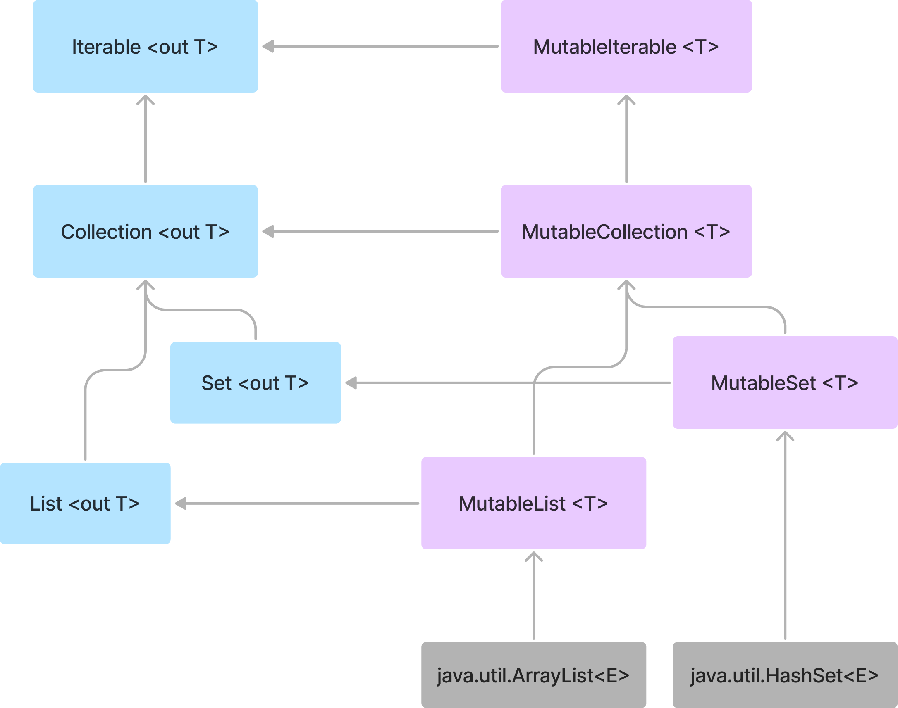

# Item 1 : Limit mutability

Kotlin은 '불변 객체'와 '가변 객체'를 구분하여 상태를 관리할 수 있다.  
이 중 '가변 객체'를 통해 상태를 관리하는 것은 양날의 검과 같다.

시간이 지남에 따라 변하는 상태를 표현하는 것이 간편하여 유용하지만, 아래의 이유로 인해 상태 관리가 어려워 진다.

- 상태의 변화를 추적해야 하므로 코드를 이해하고 디버그하는 것이 어려움.
- 상태가 언제든지 변경될 수 있기에 로직의 추론이 어려움.
- 멀티 스레드 환경에서 동기화 메커니즘이 없는 경우, 상태의 변동성은 잠재적인 충돌을 발생함.
- 변경 가능한 모든 상태를 테스트해야 하기에 테스트가 어려움.
- 상태가 변경 되면 상태를 사용하고 있던 요소들에게 변경 사항을 반드시 알려야 함.

그럼에도, 상태 변경을 통해 실제 시스템의 상태를 나타내는 방법은 유용하기에, **가변성을 최대한 제한하고 변경점을 최소화하는 것이 중요**하다.

Kotlin은 이런 가변성을 쉽게 제한할 수 있도록 설계되었고, 이를 지원하는 다양한 기능과 특성을 제공한다.

[1. Read-only `val`](#read-only-val)  
[2. 'Mutable Collection'과 'Read-only Collection'의 분리](#mutable-collection과-read-only-collection의-분리)  
[3. `data class`의 `copy()`](#copy-in-data-classes)

## Read-only `val`

`val`은 재할당을 허용하지 않지만, 반드시 불변 값을 갖거나 최종적인 값을 의미하진 않는다.  
또한 '가변 객체를 보유'할 수 있고, 다른 프로퍼티를 의존한 뒤 'custom getter'를 통해 정의될 수 있다.

```kotlin
val a = 10
a = 20 // Error

val list = mutableListOf(1, 2, 3)
list.add(4) // OK
```

```kotlin
var name: String = "Java"
var surname: String = "Hello"
val fullName: String
    get() = "$name $surname"

fun main() {
    println(fullName) // Java Hello
    name = "Kotlin"
    println(fullName) // Kotlin Hello
}
```

위와 같이 `val`은 참조의 변경이 불가능한 대신에 'custom getter' or 'delegate'를 통해 참조 객체의 내부 상태를 변경할 수 있다.
여기서 중요한 점은 '참조의 변경이 불가능'하다는 점이다. 즉, **변경점을 제공하지 않는다.**

앞서 말한것처럼, 변경점은 동기화나 프로그램을 추론할 때 문제의 원인이 될 수 있기에 개발자들은 `var` 보다 `val`을 선호한다.

만약, 상태 변경이 필요하지 않다면, 고정된 값을 명확하게 정의하여 final 프로퍼티로 정의하는 것이 좋다 : `val name = "yongsuk"`

## 'Mutable Collection'과 'Read-only Collection'의 분리



Kotlin에서 컬렉션 계층 구조는 위와 같이 설계되어 있기에 'Read-only Collection'을 지원한다.

하늘색 박스들은 'Read-only Collection'으로 수정을 허용하는 메소드를 제공하지 않는다.  
반면, 보라색 박스들은 'Mutable Collection'으로 'Read-only Collection'을 확장하고, 수정을 허용하는 메서드를 제공한다.

이는 Kotlin 프로퍼티가 작동하는 방식과 유사하며, `val`은 'getter'만을 포함하고, `var`은 'getter'와 'setter'를 포함한다.

'Read-only Collection'도 `val`의 'getter' 방식과 동일하게 내부적으로 변경이 가능하지만, 외부에서는 변경이 불가능하다.
예를 들어, `Iterable<T>.map`은 `ArrayList`를 생성하여 작업을 수행하고, 서브 타입인 'Read-only Collection'인 `List`로 반환하여 외부에서 변경이 불가능하도록 한다.

```kotlin
inline fun <T, R> Iterable<T>.map(
    transform: (T) -> R
): List<R> {
    val list = ArrayList<R>()
    for (item in this@map) {
        list.add(transform(item))
    }
    return list
}
```

위와 같이 'Read-only Collection'은 많은 유연성을 제공한다.  
예를 들어, 메모리 사용이 중요한 모바일 앱의 경우 `ArrayList`를 통해 작업을 수행하고, 'Read-only Collection'으로 반환 할 수 있다.
그리고 빠른 Insert/Delete 작업이 필요한 서버 사이드는 `LinkedList`를 통해 작업을 수행하고, 'Read-only Collection'으로 반환 할 수 있다.

주의할 점은 개발자가 의도적으로 'Read-only Collection'을 'Down-casting'하여 컬렉션의 불변성을 우회하려는 시도해서는 안된다.
이는 모든 Kotlin 개발자들의 'contract'로써 지켜져야 한다.

```kotlin
// Don't do this
val list = listOf(1, 2, 3)

if (list is MutableList) {
    list.add(4)
}
```

    위 코드 중 `listOf()`는 JVM 환경에서는 `ArrayList`를 반환하기에, 주의해야 함.
    Java의 `List`는 Kotlin의 `MutableList`와 같이 다를 수 있는것처럼 보이지만, 
    `ArrayList`는 `MutableList`의 모든 연산을 지원하지 않고 '다르기에' 주의애야 함.

만약 'Read-only Collection'을 'Mutable Collection'로 변환하고 싶다면, `toMutableList()`를 사용하여 새로운 객체롭 복사하여 사용하자.

```kotlin
val list = listOf(1, 2, 3)

val mutableList = list.toMutableList()
mutableList.add(4)
```

## Copy in data classes

`String`, `Int`와 같이 내부 상태가 변하지 않는 불변 객체를 선호하는 이유는 다음과 같다.

- 한 번 생성된 후 변경되지 않으므로, 프로그램 추론이 쉬움.
- 불변 객체는 공유되어도 상태가 변하지 않아, 병렬 프로그래밍 시 'Race-condition', 'Deadlock' 등 문제를 방지할 수 있음.
- 상태가 변경되지 않기에, 불변 객체의 참조를 안전하게 캐싱하여 여러 곳에서 재사용이 가능함.
- 복사할 때 원본 객체의 상태가 변하지 않으므로, 'Defensive copy', 'Deep copy' 등 필요하지 않음.
- 상태가 변경되지 않기에, 불변 객체를 기반으로 다른 객체를 구성하기 좋음
- `Set`에 추가하거나 `Map`의 키로 사용할 수 있음.

```kotlin
val names: SortedSet<FullName> = TreeSet()
val person = FullName("AAA", "AAA")
names.add(person)
names.add(FullName("BBB", "BBB"))
names.add(FullName("CCC", "CCC"))

print(names) // [AAA AAA, BBB BBB, CCC CCC]
print(person in names) // true

person.name = "ZZZ"
print(names) // [ZZZ AAA, BBB BBB, CCC CCC]
print(person in names) // false, because person is at incorrect position
```

불변 객체에 데이터 변경이 필요한 경우, 객체 내부의 변경이 아닌 데이터 변경 후의 새로운 객체를 생성하는 메서드를 사용해야 한다.
예를 들어, `Int`에서 `plus`, `minus` 메서드는 연산 후 새로운 `Int`를 반환하는 것처럼 말이다.

```kotlin
class User(
    val name: String,
    val surname: String
) {
    fun withSurname(surname: String): User = User(name, surname)
}

// usage
var user = User("yongsuk", "park")
user = user.withSurname("kim")
print(user) // User(name=yongsuk, surname=kim)
```

그러나 위와 같은 작업은 모든 프로퍼티에 대해 수행하는 경우 번거로운 작업이 될 수 있기에, `data class`의 `copy()`를 사용하는 것이 좋다.
`copy()`는 기존 객체의 상태를 기본값으로, 변경하고자 하는 특정 프로퍼티만 새로운 값으로 지정하여 새로운 객체로 생성할 수 있다.

```kotlin
data class User(
    val name: String,
    val surname: String
)

// usage
var user = User("yongsuk", "park")
user = user.copy(surname = "kim")
print(user) // User(name=yongsuk, surname=kim)
```

## Different kinds of mutation points

변경이 가능한 목록이 필요하면 'Mutable Collection' 또는 `var`을 통해 만들 수 있다.

```kotlin
val list: MutableList<Int> = mutableListOf()
var list2: List<Int> = listOf()

list.add(1)
list2 = list2 + 1
```

만약 목록을 변경할 때 'plus-assign'을 사용하여 변경한다면, 각각 다른 행동으로 동작된다.

```kotlin
list1 += 1 // Translates to list1.plusAssign(1)
list2 += 1 // Translates to list2 = list2.plus(1)
```

'Mutable Collection'은 리스트 구현체에서 변화가 일어나고, 구현이 직관적이 쉽다.

`var`은 해당 프로퍼티 자체를 단일 변경점으로 갖고 있기에 해당 속성에 대한 접근을 제어함으로써 동기화 관리가 수월하다.
또한 `var`은 'custom setter' 또는 'Delegate'를 사용하여 프로퍼티에 대한 변경을 추적할 수 있다.

```kotlin
var names by Delegates.observable(listOf<String>()) { _, old, new ->
    println("Names changed from $old to $new")
}

names += "Yongsuk" // Names changed from [] to [Yongsuk]
names += "Minsu" // Names changed from [Yongsuk] to [Yongsuk, Minsu]
```

그럼에도 위 2가지 방법은 가변 상태를 가지고 있어 멀티 스레드 환경에서 동기화 문제가 있기에 별도로 동기화 메커니즘을 구현해서 사용해야 한다.
또한 상태를 변경하는 모든 방식은 비용이 되기에 일반적인 경우에는 불필요한 상태 변경 가능성을 제거하는 것이 좋다.
