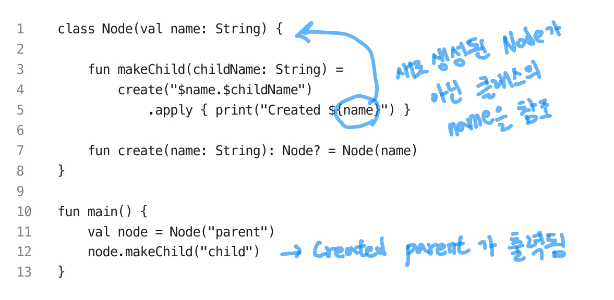

## 15. 리시버는 명시적으로 참조 (특히 여러 개일 때!!)

- 스코프 내에 리시버를 여러 개 사용하는 경우, 가독성을 위해 명시적으로 참조하자
  - ex) 내부적으로 리시버를 제공하는 스코프 함수인 `apply`, `with`, `run` 함수를 사용하는 경우
- 리시버가 여러 개일 때, 명시하지 않게 된다면 아래처럼 오해의 소지를 불러일으킬 수 있다!


    ```kotlin
    // 이렇게 변경해주자!
    fun makeChilde(childName: String) =
        create($name.$childName)
            .apply { print("Created ${this@apply?.name}") }
    ```