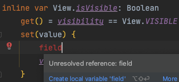

## 16. 프로퍼티는 상태를 나타내기

- Kotlin의 프로퍼티는 자바의 필드와 비슷하지만, 지원되는게 더 다양함
- 프로퍼티를 선언하면 자동으로 게터와 세터를 구현해줌
  - 이는 프로퍼티의 데이터를 저장하는 백킹 필드를 통해서 구현이 됨
  - var의 경우, 게터/세터 모두 지원하기 때문에 백킹 필드가 자동 생성되지만, 읽기 전용 프로퍼티인 val의 경우 백킹 필드가 자동 생성되지 않기 때문에 게터 기능만 지원함

```kotlin
val name: String
    get() = nameEditText.text

var age: Int
    get() = ageSpinner.selectedItem as? Int ?: 0
    set(value) {
        field = value
    }
```

<!-- > Computed Properties, Derived Properties -->

### 위임 프로퍼티 & 확장 프로퍼티

- [코틀린에서 자주 사용되는 델리게이트 프로퍼티들](https://leveloper.tistory.com/169)
  - `lazy`: 지연 초기화, 처음으로 호출되는 시점에 초기화됨
  - `Delgates.observable`: 변화가 있을 때 감지
  - `Delgates.vetoable`: 반환 값이 있는 observable
    - onChange할 때마다 boolean 값을 반환, 반환 값이 true일 때만 실행 
  - `Delgates.notNull`
- 확장 프로퍼티
    ```kotlin
    inline var View.isVisible: Boolean
        get() = visibility == View.VISIBLE
        set(value) {
            visibility = if (value) View.VISIBLE else View.GONE
        }
    ```

<br/>

> [**lateinit과 Delegates.notNull의 차이점**](https://stackoverflow.com/questions/44205389/difference-between-delegates-notnull-and-lateinit-kotlin)

> **inline property는 백킹 필드를 구현하지 않는다!**   
> inline 지시자를 붙인 함수/프로퍼티는 호출한 곳으로 코드가 인라이닝되므로, inline 프로퍼티는 내부적으로 백킹 필드를 구현하지 않는다.
> 
>
> 아래는 inline을 붙인 isVisible 함수와 붙이지 않은 일반 함수를 자바 코드로 디컴파일한 결과이다.
> ```java
> public static final void main() {
>      View view = /* View 생성... */;
>
>      boolean inline = view.getVisibility() == 1; // 인라이닝됨
>      boolean noinline = isVisible(view);
> }
> ```


### 함수로 정의하는게 더 나은 경우

- 연산 비용이 높거나 복잡도 O(1)보다 큰 경우: 관습적으로 프로퍼티를 사용하는 데 많은 비용이 들지 않는다고 생각하기 때문에 이를 지켜주어야 함
- 비즈니스 로직이 포함되는 경우
- 결정적이지 않은 경우: 동작을 연속적으로 호출했을 때 다른 값이 나오는 경우 (`random()` 등...)
- 게터에서 상태 변경이 일어나는 경우
- 타입 변환의 경우: 타입의 변환은 `Int.toString()`과 같은 형태를 많이 사용하기 때문에 함수로 사용하기

### 이럴 때는 프로퍼티를 사용하자

가장 기본적으로 위에서 서술한 함수의 조건을 만족하지 않아야 함!
- 프로퍼티를 함수명으로 바꾸었을 때, 접두사에 get/set을 붙이는 경우
- 상태를 추출/설정하기 위한 목적인 경우

```kotlin
// 으...
class AuthDialog {
    private var authType = AuthType.Rating
    
    fun getAuthType(): AuthType = type

    fun setAuthType(type: AuthType) {
        this.type = type
    }
}

// 편-안
class AuthDialog {
    var type = AuthType.Rating 
}
```