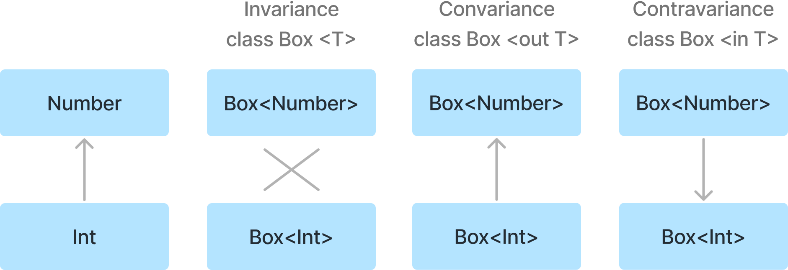
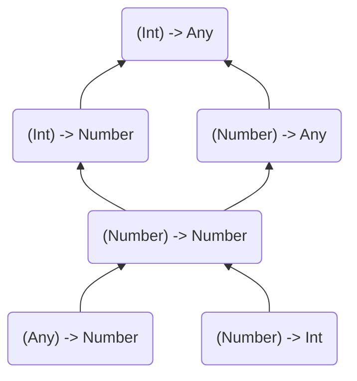

# Item 24 : Consider variance for generic types

아래와 같은 제네릭 클래스 'Cup'은 '타입 파라미터 `T`'가 'variance modifier'를 적용하지 않아, 기본적으로 불변성을 가진다.  
즉, 'Cup' 클래스를 사용하여 생성된 타입들 간에서는 서로 '관계'가 없다는 것을 의미한다.

예를 들어, 다음과 같은 타입들 사이에 '관계'가 없다는 것을 의미한다.

```kotlin
class Cup<T>

val anys: Cup<Any> = Cup<Int>()             // Error: Type mismatch
val nothings: Cup<Nothing> = Cup<Int>()     // Error: Type mismatch
```

만약, 생성된 타입들 간에 '관계'를 가지고 싶다면, 'variance modifier'를 통해 다음과 같이 지정할 수 있다.

'out' 키워드를 통해 타입 파라미터에 공변성을 지정할 수 있다.  
예를 들어, 'Cup'이 공변성을 가지고 있고, 'Puppy'가 'Dog'의 하위 타입이면 `Cup<Puppy>`는 `Cup<Dog>`의 하위 타입이 된다.

```kotlin
class Cup<out T>

open class Dog
class Puppy: Dog()

fun main() {
    val dog: Cup<Dog> = Cup<Puppy>()            // OK
    val puppy: Cup<Puppy> = Cup<Dog>()          // Error: Type mismatch
    
    val anys: Cup<Any> = Cup<Int>()             // OK
    val nothings: Cup<Nothing> = Cup<Int>()     // Error: Type mismatch
}
```

'in' 키워드를 통해 타입 파라미터에 반공변성을 지정할 수 있다.  
예를 들어, 'Cup'이 반공변성을 가지고 있고, 'Puppy'가 'Dog'의 하위 타입이면 `Cup<Puppy>`는 `Cup<Dog>`의 상위 타입이 된다.

```kotlin
class Cup<in T>

open class Dog
class Puppy: Dog()

fun main(args: Array<String>) {
    val dog: Cup<Dog> = Cup<Puppy>()            // Error: Type mismatch
    val puppy: Cup<Puppy> = Cup<Dog>()          // OK
    
    val anys: Cup<Any> = Cup<Int>()             // Error: Type mismatch
    val nothings: Cup<Nothing> = Cup<Int>()     // OK
}
``` 

이러한 불변성, 공변성, 반공변성은 아래와 같은 다이어그램으로 간단하게 나타낼 수 있다.



## Function types

제네릭 클래스와 달리, 함수 타입들 사이에서는 예상되는 타입, 파라미터, 반환 타입 등이 서로 달라도 '관계'를 가질 수 있다.  
즉, 함수의 파라미터 타입이나 반환 타입이 서로 달라도, 함수 타입들이 서로 호환될 수 있다.

```kotlin
fun printProcessNumber(transition: (Int) -> Any) {
    print(transition(42))
}

val intToDouble: (Int) -> Number = { it.toDouble() }
printProcessNumber(intToDouble)

val numberAsText: (Number) -> Any = { it.toShort() }
printProcessNumber(numberAsText)

val identity: (Number) -> Number = { it }
printProcessNumber(identity)

val numberToInt: (Number) -> Int = { it.toInt() }
printProcessNumber(numberToInt)

val numberHash: (Any) -> Number = { it.hashCode() }
printProcessNumber(numberHash)
```

이처럼 서로 호환될 수 있는 이유는 함수의 모든 타입들 사이에는 다음과 같은 '관계'가 존재하기 때문이다.



위 계층 구조를 따라 아래로 내려갈 때, 타입 시스템 내에서 다음과 같이 이동됨을 알 수 있다.

- 파라미터 타입은 더 상위 타입으로 이동
- 반환 타입은 더 하위 타입으로 이동

이를 통해 알 수 있는 점은, 함수 타입에서 파라미터 타입들은 반공변성을 가지고, 반환 타입들은 공변성을 가지는 점을 알 수 있다.

> ( T<sub>1in</sub> , T<sub>2in</sub> ) → T<sub>out</sub>

## The safety of variance modifiers

Java에서 배열은 타입에 관계없이 모든 배열에 정렬과 같은 일반적인 연산을 수행할 수 있도록 하기 위해 '공변성'을 가지고 있도록 설계되었다.
그러나, 이런 설계는 다음과 같은 문제점을 가지고 있다.

```java
Integer[] numbers = new Integer[] { 1, 2, 3 };
Object[] objects = numbers;

void test() {
    objects[2] = "Hello";   // Runtime Error: ArrayStoreException
}
```

'numbers'를 'Object[]'로 캐스팅하지만, 내부적으로 사용되는 타입은 변경되지 않고 'Integer'로 유지된다.  
이러한 상태에서 'objects'에 'String' 타입의 값을 할당하려고 시도하면 타입이 다르기에 오류가 발생하게 된다.

이처럼 컴파일할 때에는 오류가 발생되지 않지만, 런타임에 오류가 발생하게 되며, 이런 상황은 Java의 문제점을 명확하게 보여준다.

---

Kotlin에서는 이러한 문제를 일찍이 인지하고, 프로그램을 보호하기 위해서 배열을 불변성으로 설정하였다.   
즉, `Array<Int>`를 `Array<Any>`로 업캐스팅 하는 것을 허용하지 않는다.

그러나, Kotlin에서 함수의 파라미터로 특정 타입이 요구될 때, 해당 타입의 하위 타입도 전달될 수 있다는 점을 알고 있어야 한다.
즉, 'argument'를 전달할 때 암시적인 업캐스팅이 가능함을 알고 있어야 한다.

```kotlin
open class Dog
class Puppy: Dog()
class Hound: Dog()

fun takeDog(dog: Dog) { 
    // ...
}

takeDog(Dog())
takeDog(Puppy())
takeDog(Hound())
```

이러한 암시적인 업캐스팅은 '공변성'을 적용할 때 문제가 될 수 있다.

만약, '공변 타입 파라미터 `T`'가 'public in-position(함수의 파라미터 타입)'으로 적용되면, 공변성과 업캐스팅이 결합되어 어떤 하위 타입이든 전달할 수 있게 된다.
이렇게 될 경우, 예상치 못한 타입이 전달될 수 있기에 프로그램의 안정성을 해칠 수 있다.

```kotlin
class Box<out T> {
    private var value: T? = null
    
    fun set(value: T) {     // Illegal in Kotlin
        this.value = value
    }

    fun get(): T = 
        value ?: error("Value not set")
}

val puppyBox = Box<Puppy>()
val dogBox: Box<Dog> = puppyBox
dogBox.set(Hound())         // But I have a place for a Puppy

val dogHouse = Box<Dog>()
val box: Box<Any> = dogHouse
box.set("Some string")      // But I have a place for a Dog
box.set(42)                 // But I have a place for a Dog
```

그렇기에, Kotlin에서는 이런 문제를 방지하기 위해 '공변 타입 파라미터'를 'public in-position'에서 사용하는 것을 허용하지 않는다.
이에 따라, 'visibility'를 'private'으로 제한하여 객체 외부에서의 공변성을 이용한 업캐스팅을 제한하고, 객체 내부에서 필요한 작업을 수행하도록 한다.

```kotlin
class Box<out T> {
    private var value: T? = null
    
    private fun set(value: T) {
        this.value = value
    }
    
    fun get(): T = value ?: error("Value not set")
}
```

반대로, 'public out-position'은 안전하다고 판단하여 따로 제약을 두지 않는다.  
이러한 이유로, 데이터 생성자나 불변 데이터를 갖는 경우, '공변성'을 적용하는 것이 좋다.

예를 들어, 함수가 파라미터 타입 `List<Any?>`를 요구할 때, `List<out E>`를 사용하면
`E`는 어떤 타입이든 간에 `Any` 타입의 하위 타입이므로, 변환 없이 제공할 수 있다.

```kotlin
fun printList(list: List<Any?>) {
    list.joinToString().let(::println)
}

val intList: List<Int> = listOf(1, 2, 3)
val stringList: List<String> = listOf("A", "B", "C")

printList(intList)      // OK
printList(stringList)   // OK
```

반면, `MutableList<E>`는 불변성을 가지기에 정확한 타입을 요구하며, 이런 불변성으로 불안전한 상황을 방지한다.

```kotlin
fun append(list: MutableList<Any>) {
    list.add(42)
}

val strs = mutableListOf<String>("A", "B", "C")
append(strs) // Illegal in kotlin
```

---

위 공변성과 'public in-position'의 문제와 유사하게, 반공변성과 'public out-position'의 문제도 존재한다.

'out-position'은 아래와 같은 암시적인 업캐스팅을 허용한다.

```kotlin
open class Car
interface Boat
class Amphibious: Car(), Boat

fun getAmphibious(): Amphibious = Amphibious()      // out-position

val car: Car = getAmphibious()                      // Upcasting
val boat: Boat = getAmphibious()                    // Upcasting
```

하지만, 이런 암시적인 업캐스팅은 반공변성에서 문제가 될 수 있다.

'out-position'에 반공변성 타입 파라미터를 적용하게 되면, 다른 타입의 객체를 반환할 수 있는 문제가 발생할 수 있다.  
아래 예시를 보면, 'Box'에서 생성된 타입과 완전히 다른 타입이 반환될 수 있는 문제가 발생한다.

```kotlin
class Box<in T> {
    val value: T   // Illegal in Kotlin
}

val garage: Box<Car> = Box(Car())
val amphibiousSpot: Box<Amphibious> = garage
val boat: Boat = garage.value       // But I only have a Car

val noSpot: Box<Nothing> = Box<Car>(Car())
val boat: Nothing = noSpot.value    // I cannot product Nothing
```

Kotlin에서는 이러한 상황을 방지하기 위해 'public out-position'에서 반공변성 타입 파라미터의 사용을 허용하지 않는다.
이에 따라 'visibility'를 'private'으로 제한하여 객체 외부에서의 반공변성을 이용한 다운캐스팅을 제한하고, 객체 내부에서 필요한 작업을 수행하도록 한다.

```kotlin
class Box<in T> {
    private var value: T? = null
    
    fun set(value: T) {
        this.value = value
    }
    
    private fun get(): T = value ?: error("Value not set")
}
```

이처럼 반공변성 타입 파라미터는 오로지 사용되거나 수용될 때 사용되며, 예시로는 'Coroutine'의 'Continuation'이 있다.

```kotlin
public interface Continuation<in T> {
    public val context: CoroutineContext
    public fun resumeWith(result: Result<T>)
}
```

## Variance modifier positions

'variance modifier'는 두 가지 위치에서 사용될 수 있다.

앞서 적용한 것과 같이 클래스나 인터페이스를 선언할 때 적용하는 'declaration-side'에서의 사용이다.

```kotlin
class Box<out T>(val value: T)      // Declaration-side variance modifier 
val boxStr: Box<String> = Box("Hello World")
val boxAny: Box<Any> = boxStr
```

또 다른 하나는 특정 변수에 대한 'variance modifier'를 적용하는 'use-site'에서의 사용이다.

```kotlin
class Box<T>(val value: T) 
val boxStr: Box<String> = Box("Hello World")
val boxAny: Box<out Any> = boxStr   // use-side variance modifier
```

이러한 'use-site variance'는 모든 인스턴스에 'variance modifier'를 제공할 수 없는 상황에서 하나의 타입만 제공하고 싶을 때 유용하다.

예를 들어, `MutableList<E>`에 반공변성을 적용하게 되면, 해당 컬렉션이 원소를 반환하는 것이 불가능해지기에 사용할 수 없다.
하지만, 단일 파라미터 타입을 반공변성 타입으로 만들어, 어떤 타입도 받아들일 수 있는 컬렉션으로 만들 수 있다.

```kotlin
interface Dog
interface Cutie

data class Puppy(val name: String) : Dog, Cutie
data class Hound(val name: String) : Dog
data class Cat(val name: String) : Cutie

fun fillWithPuppies(list: MutalbleList<in Puppy>) {
    list.add(Puppy("Bobby"))
    list.add(Puppy("Rex"))
}

val dogs = mutableListOf<Dog>(Hound("Max"))
fillWithPuppies(dogs)
println(dogs)       // [Hound(name=Max), Puppy(name=Bobby), Puppy(name=Rex)]

val animals = mutableListOf<Cutie>(Cat("Smokey"))
fillWithPuppies(animals)
println(animals)    // [Cat(name=Smokey), Puppy(name=Bobby), Puppy(name=Rex)]
```

---

'variance modifier'를 사용할 때, 특정 위치에서의 사용이 제한될 수 있음을 알아야 한다.  
`MutableList<out E>`의 경우 `set`은 `T`의 모든 하위 타입, 즉 `Nothing`을 포함한 모든 타입이 전달될 수 있기에 사용할 수 없다.
또한, `MutableList<in T>`의 경우 `get`은 `T`의 모든 상위 타입, 즉 `Any?`를 포함한 모든 타입이 반환될 수 있기에 사용할 수 없다.

결과적으로, 제네릭 객체에서 오직 읽기만 하는 경우에는 공변성(out)을, 쓰기만 하는 경우에는 반공변성(in)을 사용하는 것이 좋다.
