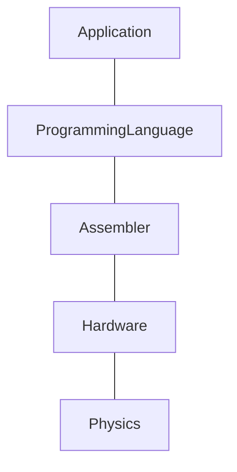
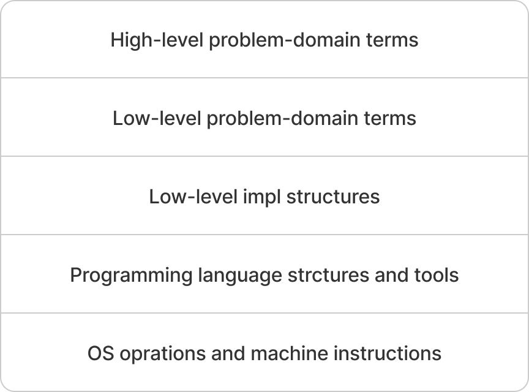
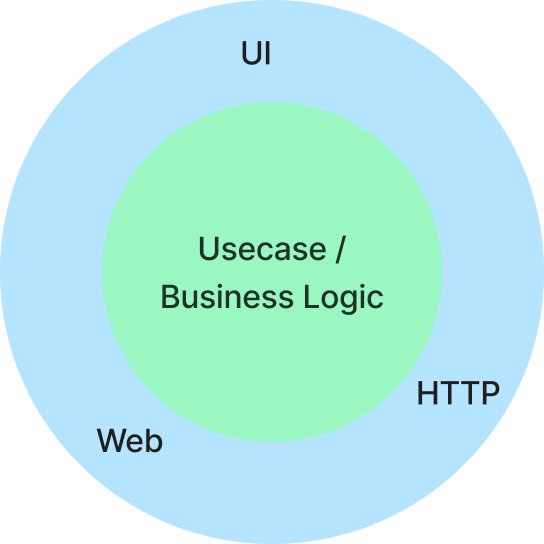

# Item 26 : Each function should be written in terms of a single level of abstraction

잘 분리된 계층 구조는 특정 계층에서 작업을 할 때, 하위 계층이 예상한 대로 동작할 것이라는 믿음을 바탕으로 모든 세부 사항을 깊게 이해하지 않아도 된다.
이러한 장점은 어셈블리 언어나 JVM 바이트코드에 대한 지식을 갖지 않아도 프로그래밍을 할 수 있다는 것을 의미한다.

이로 인해, 컴퓨터 과학에서는 계층 위에 계층을 쌓아 올리면서, 어떤 기술이나 언어가 얼마나 '고수준(high-level)'인지를 구분하기 시작했다.
더 높은 수준일수록 물리적인 부분으로부터 멀어지며, 프로그래밍에서는 프로세서와 멀어지는 것을 의미한다.



고수준일수록 세부적인 부분에 대해 걱정을 하지 않아도 된다는 장점이 있지만, 이는 동시에 제어력의 손실과 교환하는 것을 의미한다.
예를 들어, Java에서는 메모리 관리를 가비지 컬렉터가 자동으로 해주지만, 메모리 최적화를 하는 것이 더 어렵다.

## Single Level of Abstraction Principle

복잡한 문제를 해결하기 위해서 코드 작성 시에도 추상화를 적용할 수 있으며, 이를 위한 가장 기본적인 방법은 '함수'를 사용하는 것이다.
이때, 'SLAP(함수를 한 가지 추상화 수준에서 구현)'를 도입하면 프로그램의 각 로직들이 어떻게 상호작용 하는지 명확하게 이해할 수 있다.

예를 들어, 커피 머신 클래스가 있다고 가정해 보자.  
커피를 만드는 과정은 여러 단계를 거치며, 이를 단일 함수 'makeCoffee'로 전체 과정을 표현할 수 있다.

```kotlin
class CoffeeMachine {

    fun makeCoffee() {
        // ...
    }
}
```

그러나, 위와 같은 함수는 기능이 추가되고 수정될 수록 코드가 길어지며, 극단적으로는 수백 줄에 달하는 코드로 구현될 수 있다.
이렇게 긴 함수는 읽을 수 없을 정도로 복잡하고, 어떤 동작을 하는지 파악하기 어려워진다.
또한, 전체적인 맥락을 이해하기 어려워지고, 특정 부분을 찾는 것도 쉽지 않아진다.

이러한 단점으로 인해, 고수준의 함수는 'high-level step' 별로 분리하여 함수로 작성하는 것이 좋다.

```kotlin
class CoffeeMachine {

    fun makeCoffee() {
        boilWater()
        brewCoffee()
        pourCoffee()
        pourMilk()
    }

    private fun boilWater() { /* ... */
    }
    private fun brewCoffee() { /* ... */
    }
    private fun pourCoffee() { /* ... */
    }
    private fun pourMilk() { /* ... */
    }
}
```

이렇게 함으로써, 처음 시작 할 작업과 각 단계의 절차들을 쉽게 이해할 수 있도록 단순화할 수 있다.  
또한, 각각의 'private' 함수들은 책의 파트처럼, 전체적인 구조에서 특정 부분을 담당하는 것처럼 보이게 할 수 있다.
이는 코드를 더 읽기 쉽게하고, 누군가 세부적인 구현을 이해하고자 할 때, 간편하게 이동하여 확인하거나 수정할 수 있게 한다.  
이처럼 간단한 추상화를 통해 'high-level step'을 분리함으로써 전체적인 가독성과 유지보수성을 높일 수 있다.

'SLAP' 원칙에 따르면 새롭게 추가되는 함수들도 간단하게 유지되어야 한다.  
만약, 프로그램 내 추상화 된 함수 보다 더 복잡한 함수가 존재하면, 'intermediary abstraction'로 추출해야 한다.
이를 통해, 읽기 쉬운 작은 단위의 함수들을 여럿으로 만들고, 이들 모두 동일한 'single level abstraction'으로 맞춰야 한다.
'every level abstraction'에서는 '추상적인 용어(메서드나 클래스)'로 작업하며, 해당 기능이나 데이터가 어떻게 구현되는지 이해하려면 해당 정의로 직접 이동하여 확인할 수 있다.

위와 같은 방식으로 함수를 분리함으로써 프로그램의 기능이나 동작에 영향을 주지 않으면서, 가독성을 크게 향상할 수 있다.

추가적으로, 함수 분리 시, 각 함수들을 재사용하거나 단위 테스트하기 용이하다는 장점도 얻을 수 있다.  
예를 들어, 다른 에스프레소 커피를 만들기 위해 별도의 함수를 설정해야 한다면, 추출된 함수를 재사용하여 쉽게 구현할 수 있다.

```kotlin
fun makeEspressoCoffee() {
    boilWater()
    brewCoffee()
    pourCoffee()
}
```

## Abstraction levels in program architecture

추상화 계층의 개념은 함수보다 더 높은 수준에도 적용이 가능하다.

프로그램 구조를 추상화하여 분리하면 다음과 같은 이점을 얻을 수 있다.

- 하위 시스템의 세부 구현을 숨겨, 시스템의 다른 부분에 영향을 주지 않고 내부 구현을 변경할 수 있다.
- 프로그램 내 서로 다른 관심사를 분리하며, 특정 로직에 대한 변경이 전체 시스템에 미치는 영향을 최소화한다.
- 시스템 구성 요소 간 상호작용을 원활하게 하고, 다양한 플랫폼에서도 동작하도록 한다.
- 비지니스 로직을 'problem-domain terms'로 표현하게 하여 기술적인 세부 사항보다는 실제 문제를 해결하는데 집중할 수 있다.



이러한 개념은 모듈형 시스템을 설계할 때도 중요하다.
독립적으로 분리된 모듈은 특정 계층의 요소를 숨기는데 효과적인 방법을 제공한다.

예를 들어, 애플리케이션 개발 시 일반적으로 화면을 출력하거나 백엔드의 HTTP 처리 등을 담당하는 모듈은 하위 계층 모듈로 간주되고,
'Usecase', '비지니스 로직'을 다루는 모듈은 보다 상위 계층 모듈로 간주된다.



이처럼 잘 분리된 계층 구조를 가진 프로젝트는 시스템의 어느 한 부분을 확인하더라도, 전체 구조와 해당 계층의 역할, 기능, 연결성을 쉽게 이해할 수 있다.

예를 들어, 소프트웨어 개발에서 'DB 설계', 'UI 개발', 'API 개발' 등 분리된 계층 구조를 가질 때,
'API 개발'을 살펴보면 **해당 계층이 어떻게 데이터 베이스와 연결되고, UI에 어떤 데이터를 제공하는지 쉽게 이해**할 수 있다.

이러한 장점이 있기에 프로그램 개발 시 잘 분리된 계층 구조를 가진 프로젝트를 선호한다.