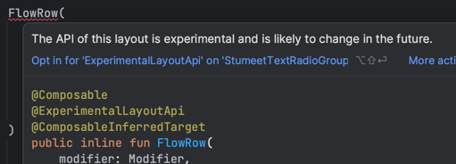

# Item 28 : Specify API stability

프로그래밍에서는 'Stable standard API'를 선호하며, 이유는 다음과 같다.

1. 불안정한 API는 자주 업데이트 되기에, 업데이트될 때마다 API 사용자에게 추가적인 작업과 변경사항을 요구한다.
    - API 사용 방식이 변경된 경우, 이에 맞춰 기존 코드를 수정해야 하는 부담감이 생김.
    - 변경사항을 적용하지 않는 경우, 'Bugfix', 'Vulnerability corrections'과 같은 필수 사항이 누락되기에 프로젝트에 문제가 발생할 수 있음.
2. API 업데이트 내용 또한 'knowledge'로 취급되기에, 이를 다시 학습하고 이해하는데 시간과 노력이 필요하다.

시간이 흐름에 따라 사용자 요구사항과 기술의 발전으로 기존 API를 개선해야 하는 상황이 발생할 수 밖에 없다.  
하지만, 이런 변경은 위에 언급한 것과 같이 사용자에게 부담을 주기에, 이를 완화하고자 API 안정성을 명시하기 시작하였다.

가장 간단한 방법은 해당 API 안정성을 문서화하여 사용자들에게 보여주는 방식이 있지만,
보다 공식적으로 'Semantic Versioning'을 통해 API 버전을 명시하는 것이 좋다.

'Semantic Versioning'은 'MAJOR', 'MINOR', 'PATCH' 버전을 통해 API의 안정성을 명시하며 다음과 같은 규칙을 따른다.

- MAJOR : 이전 버전과 '호환되지 않는 변경사항'이 있을 때 증가
- MINOR : 이전 버전과 호환되는 '새로운 기능이 추가'되었을 때 증가
- PATCH : 이전 버전과 호환되는 '버그 수정'이 있을 때 증가
- 'MAJOR' 버전이 증가되면, 'MINOR'와 'PATCH' 버전은 0으로 설정
- 'MINOR' 버전이 증가되면, 'PATCH' 버전은 0으로 설정
- 'Pre-release' 출시 시 'MAJOR.MINOR.PATCH' 뒤에 'alpha/beta/rc' 표기 : [link](https://semver.org/#spec-item-9)
- 'Build metadata'는 'MAJOR.MINOR.PATCH' 뒤에 'mata-data' 표기 : [link](https://semver.org/#spec-item-10)
- 'MAJOR' 버전이 0인 경우, 초기 개발을 의미하여 언제든지 변경될 수 있기에 불안정한 API로 간주해야 함

불안정한 요소를 안정화된 API에 추가하고, 일부 사용자에게 사용할 수 있도록 허용하고 싶을 때는 `@Experimental` 어노테이션을 명시하여 사용자에게 경고나 오류를 표시할 수 있다.



또는 안정화된 API의 일부를 변경해야 하는 경우, 사용자에게 이런 변경사항을 처리할 수 있도록 도와주기 위해 `@Deprecated` 어노테이션을 명시하여 사용자에게 알릴 수 있다.

```kotlin
@Deprecated(
    message = "Use suspending 'getUsers()' instead",
    replaceWith = ReplaceWith("getUsers()"),
    level = DeprecationLevel.WARNING
)
fun getUsers(callback: (List<User>) -> Unit) {
    // ...
}

suspend fun getUsers(): List<User> {
    // ...
}
```