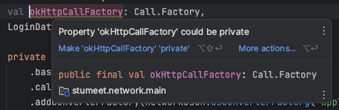

# Item 30 : Minimize elements visibility

API를 설계할 때 가능한 간결하게 만드는데에는 다음과 같은 이유가 있다.

**인터페이스가 작을수록 러닝커브가 낮고, 유지보수 하기 더 쉽다.**  
수십개의 메서드를 지닌 클래스 보단, 몇 개의 메서드를 지닌 클래스가 이해하기 쉽다.
또한, 공개된 요소들이 적을 수록, 변경사항이 발생했을 때 영향을 받는 코드가 적어지고 테스트 할 항목들이 줄어 유지보수가 쉬워진다.

**API에 변경사항을 적용하고 싶을 때, 기존 요소를 숨기는 것보다 새로운 요소를 노출하는 것이 더 쉽다.**  
'public API'의 변경은 사용자 코드에 대한 업데이트가 필수적이며, 이는 'public API'가 오래 될수록 더 많은 사용자가 있어 더욱 광범위하게 영향을 준다.
여기에 더해, 'public API' 요소에 가시성을 제한하는 것은 이미 사용 중인 기능에 대한 대안을 제공해야함으로 더욱 복잡하고 어렵다.  
이러한 이유로, 처음부터 사용자들이 간결한 API를 사용하도록 강제하여, 변경 사항이 있을 때 새로운 요소를 쉽게 추가할 수 있도록 하는 것이 좋다.

**클래스 상태를 나타내는 프로퍼티가 외부에서 변경될 수 있으면, 자신의 상태를 책임질 수 없다.**  
클래스의 상태가 'internal contract'를 모르는 외부 환경에 의해 변경될 수 있으면, 그 상태는 불변성을 보장할 수 없다.  
아래와 같이 'elementsAdded' 프로퍼티에 가시성 제한이 없었다면,
데이터에 얼마나 많은 변경이 일어났는지 알 수 없어 해당 데이터를 신뢰할 수 없게 된다.

```kotlin
class CounterSet<T>(/* ... */) : MutableSet<T> by innerSet {

    var elementsAdded: Int = 0
        private set
}
```

이처럼 Kotlin에서 모든 프로퍼티가 기본적으로 캡슐화 되었다는 점은 접근자에 가시성을 제한할 수 있기에 매우 유용하다.

객체의 내부 상태를 보호하는 것은 서로 다른 프로퍼티가 의존성을 가질 때 특히 중요하다.  
예를 들어, 아래와 코드와 같이 'initialized'의 'setter'가 외부에 노출되었다면, 다른 프로퍼티를 신뢰할 수 없게 될 것이다.

```kotlin
class MutableLazyHolder<T>(val initializer: () -> T) {

    private var value: Any = Any()
    private var initialized = false

    override fun get(): T {
        if (!initialized) {
            value = initializer()
            initialized = true
        }

        return value as T
    }

    override fun set(value: T) {
        this.value = value
        initialized = true
    }
}
```

## Using visibility modifiers

일반적으로, 요소를 외부에 노출시켜야 하는 이유가 없다면 가시성을 제한하는 것이 좋다.  
또한, 클래스와 요소에 덜 제한적인 가시성 타입을 사용해야 할 이유가 없다면, 최대한 제한적으로 설정하는 것이 좋다.

클래스 멤버의 경우가 다음과 같은 4가지 'visibility modifier'가 있다.

| modifier         | description                          |
|------------------|--------------------------------------|
| public (default) | 선언된 클래스를 볼 수 있는 클라이언트라면 어디에서든 볼 수 있음 |
| private          | 클래스 내부에서만 볼 수 있음                     |
| protected        | 클래스 내부와 하위 클래스에서만 볼 수 있음             |
| internal         | 해당 모듈 내에서만 볼 수 있음                    |

함수, 프로퍼티, 클래스 등과 같은 'Top-level 요소'에는 다음 3가지 'visibility modifier'가 있다.

| modifier         | description       |
|------------------|-------------------|
| public (default) | 모든 곳에서 볼 수 있음     |
| private          | 같은 파일 내에서만 볼 수 있음 |
| internal         | 같은 모듈 내에서만 볼 수 있음 |

이러한 관례는 Kotlin에서도 따르며, 만약 요소가 로컬에서만 사용되면, 가시성을 'private'으로 제한하도록 다음과 같이 제안한다.



하지만 이런 규칙은 'DTO 클래스의 프로퍼티'에 적용해서는 안되며, 해당 프로퍼티는 사용되기 위해 존재하는 것이므로 표시하는 것이 좋다.
만약, 필요하지 않다면 해당 프로퍼티를 완전히 제거하는게 좋다.

```kotlin
data class User(
    val name: String,
    val age: Int
)
```