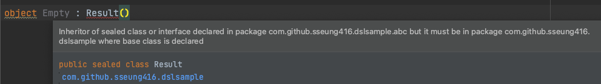

## 39. 태그 클래스보단 클래스 계층 사용하기

### 태그 클래스
- 태그 클래스: 상수 모드를 가진 클래스, 상수 모드를 태그(tag)라고 함
- 태그 클래스의 문제점
  - 여러 모드를 처리하기 위한 **보일러플레이트** 생성
  - **프로퍼티의 증가**: 모드 별로 필요한 프로퍼티가 다른 경우, 클래스의 프로퍼티가 매우 커질 수 있고 필요없는 프로퍼티까지 소유해야 함
  - **팩토리 메서드**: 객체가 제대로 생성됐는지 확인하려면 결국 팩토리 메서드를 부가적으로 구현해야 함

### sealed 클래스
- 코틀린에서는 태그 클래스보단 sealed 클래스를 사용: 하나의 클래스에 상수 모드를 정의하는 게 아니라, 여러 개의 클래스가 각각의 모드가 되는 방식
- sealed 클래스는 외부 모듈/패키지에 서브 클래스를 정의하는 것을 제한하기 때문에 새로운 타입이 추가되지 않을 것이라는게 보장됨
  - when문 사용 시 else를 생략할 수 있다! 
  - abstract 클래스는 이를 제한하지 않기 때문에 문제가 생길 수 있음 

- sealed 클래스는 태그 클래스를 대체할 때, abstract 클래스는 상속 관계를 정의할 때 사용하자

### 상태 패턴
- 상태 패턴: 객체의 상태가 변경될 대, 객체의 동작이 변하는 디자인 패턴 (ex: MVC, MVP, MVVM)
- 태그 클래스와 차이점
  - 더 많은 책임을 가짐: 비즈니스 로직과 연관되었는가..로 판단해도 좋을 듯함
  - 변경이 가능: 상태는 프레젠터, 뷰모델에 소유되어 사용자의 동작에 따라 상태가 변할 수 있음  
