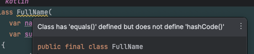

# Item 41 : Respect the contract of `hashCode`

'Any' 클래스에서 'override' 가능한 또 다른 메서드는 'hashCode'이며, 이는 'HashTable' 자료구조에서 사용된다.  
'HashTable'은 다양한 컬렉션이나 알고리즘의 내부에서 사용되며, 'HashTable'이 등장한 배경을 살펴보자.

## HashTable

요소를 신속하게 추가하는 컬렉션은 보통 중복된 요소를 허용하지 않는 'Set'과 'Map'이 있다.  
즉, 요소를 추가할 때 해당 요소와 동일한 요소가 있는지 확인한다.

배열이나 연결 리스트 기반의 컬렉션은 크기가 커질수록 이런 요소를 확인하는 과정이 느리기에, 이 문제를 해결하기 위해 'HashTable'이 등장했다.

'HashTable'은 '해시 함수'를 통해 요소마다 번호를 부여하고, 요구 사항에 따라 요소들을 다양한 '버킷'으로 분류할 수 있다.  
이후 해당 버킷들은 'HashTable'에 저장된다. 즉, 'HashTable'은 버킷의 수와 동일한 크기의 '배열'이다.

'HashTable'에서 요소를 추가할 때마다, 해시 함수의 결과를 배열의 인덱스로 사용하여 버킷을 찾는다.  
요소를 찾을 때는 같은 방식으로 버킷을 찾고, 버킷 안의 요소 중 하나와 동일한지 확인한다.  
여기서 해시 함수는 동일한 요소에 대해서 항상 같은 값을 반환해야 하므로, 다른 버킷을 확인할 필요가 없다.  
또한, 요소를 찾는데 필요한 연산 횟수를 버킷의 수로 나누어 적은 비용으로 요소를 찾을 수 있다.

아래 예시는 문자열과 4개의 버킷으로 분할되는 해시 함수가 있다고 가정한 것이다.

| Text                                           | Hash code |
|------------------------------------------------|:---------:|
| "How much wood would a woodchuck chuck"        |     3     |
| "Peter Piper picked a peck of pickled peppers" |     2     |
| "Betty bought a bit of butter"                 |     1     |
| "She sells seashells by the seashore"          |     2     |

이를 '해시 코드'를 기반으로 다음과 같은 'HashTable'을 구성할 수 있다.

| Index | Object to which hash table points                                                       | 
|:-----:|-----------------------------------------------------------------------------------------|
|   0   | []                                                                                      |
|   1   | ["Betty bought a bit of butter"]                                                        |
|   2   | ["Peter Piper picked a peck of pickled peppers", "She sells seashells by the seashore"] |
|   3   | ["How much wood would a woodchuck chuck"]                                               |

이후, 'HashTable'에 새로운 텍스트의 존재 여부를 확인할 때, '해시 코드'를 계산하게 된다.

- 해시 코드가 '0'인 경우, 해당 텍스트는 목록에 없다.
- 해시 코드가 '1' 또는 '3'인 경우, 단 하나의 텍스트와 비교한다.
- 해시 코드가 '2'인 경우, 두 개의 텍스트와 비교한다.

'Kotlin/JVM'에서 기본적으로 제공되는 'Set(LinkedHashSet)'과 'Map(LinkedHashMap)'도 이 원리를 사용한다.  
'해시 코드'를 생성하기 위해서는 'hashCode' 메서드를 사용한다.

## Problem with mutability

요소에 대한 해시는 요소가 추가될 때만 계산되며, 요소가 변경되어도 그 위치는 변경되지 않는다.  
이런 특징으로 'Set' 또는 'Map'에 객체가 추가된 후 변경될 경우, 해당 객체는 제대로 동작하지 않게 되므로 주의해야 한다.

```kotlin
data class FullName(
    var name: String,
    var surname: String
)

val person = FullName("John", "Smith")
val muSet = mutableSetOf<FullName>()
muSet.add(person)
person.surname = "Doe"

print(person)               // FullName(name=John, surname=Doe)
print(person in muSet)      // false
print(muSet)                // [FullName(name=John, surname=Doe)]
```

## The contract of `hashCode`

'hashCode'의 'contract'는 다음과 같다.

1. 동일한 객체에 대해 'hashCode' 메서드를 여러 번 호출해도, 'equals' 비교에 사용되는 정보가 변경되지 않는 한, 일관성 있는 정수 값을 반환해야 한다.
2. 'equals'를 통해 두 객체가 동등함을 확인했다면, 각 객체에서 'hashCode'를 호출했을 때 동일한 정수 값을 반환해야 한다.

첫 번째 'contract'는 'hashCode'가 일관성을 가져야 함을 의미한다.

두 번째 'contract'는 개발자들이 간과할 수 있는 중요한 사항이다.  
'hashCode'는 항상 'equals'와 일관성을 가져야 하며, 동등한 객체는 동일한 '해시 코드'를 가져야 한다.

만약, 두 번째 'contract'가 위반되면, 'HashTable' 기반 컬렉션에서 객체들이 분실될 위험이 있다.

```kotlin
class FullName(
    var name: String,
    var surname: String
) {
    override fun equals(other: Any?): Boolean =
        other is FullName && (other.name == name) && (other.surname == surname)
  
    // where is hashCode?
}

val muSet = mutableSetOf<FullName>()
muSet.add(FullName("John", "Smith"))
print(FullName("John", "Smith") in muSet)                       // false
print(FullName("John", "Smith") == FullName("John", "Smith"))   // true
```

위와 같이 예상치 못한 결과가 나오기에, 'equals'를 직접 구현한 경우에는 반드시 'hashCode'도 함께 'overriding' 해야 한다.



추가로, 요구되지 않지만, 'HashTable'을 효율적으로 만들 수 있는 방법이 있다.  
바로, 요소들의 '해시 코드'를 가능한 넓게 분산시키는 것이다.  
이는, 서로 다른 객체들이 서로 다른 해시 코드를 가지도록 하여, 해시 충돌을 최소화하고 데이터 구조의 성능을 극대화할 수 있다.

예를 들어, 아래와 같이 'hashCode'가 항상 같은 값을 반환한다면, 모든 요소가 동일한 버킷에 할당될 것이다.  
이는 기술적으로 'hashCode'의 'contract'에 만족할지 몰라도, 실질적으로 무용지물일 것이다.    
각 클래스의 'equalsCounter'를 비교해 보면, 위 내용을 확인할 수 있을 것이다.

```kotlin
class Proper(val name: String) {
    
    override fun equals(other: Any?): Boolean {
        equalsCounter++
        return other is Proper && name == other.name
    }

    override fun hashCode(): Int = name.hashCode()      // spread widely

    companion object {
        var equalsCounter = 0
    }
}

class Terrible(val name: String) {
    
    override fun equals(other: Any?): Boolean {
        equalsCounter++
        return other is Terrible && name == other.name
    }

    override fun hashCode(): Int = 0        // Do not do that, always returns the same value 0

    companion object {
        var equalsCounter = 0
    }
}

val properSet = List(10000) { Proper("$it") }.toSet()
print(Proper.equalsCounter)                 // 0

val terribleSet = List(10000) { Terrible("$it") }.toSet()
print(Terrible.equalsCounter)               // 50117047

Proper.equalsCounter = 0
println(Proper("9999") in properSet)        // true
println(Proper.equalsCounter)               // 1

Proper.equalsCounter = 0
println(Proper("A") in properSet)           // false
println(Proper.equalsCounter)               // 0

Terrible.equalsCounter = 0
println(Terrible("9999") in terribleSet)    // true
println(Terrible.equalsCounter)             // 2077

Terrible.equalsCounter = 0
println(Terrible("A") in terribleSet)       // false
println(Terrible.equalsCounter)             // 10001
```

## Implementing hashCode

앞서 설명한 것처럼 'equals'를 직접 구현할 때에만 'hashCode'도 함께 'overriding' 한다.

즉, 'equals'를 'overriding' 하지 않는다면, 'hashCode'를 'overriding' 할 필요가 없다.  
'equals'를 'overriding' 한다면, 동일한 요소에 대해서 항상 같은 값을 반환하는 'hashCode'를 'overriding' 해야 한다.

만약 객체의 중요한 프로퍼티들을 기반으로 'equality check'가 필요한 경우, 해당 프로퍼티들의 '해시 코드'를 기반으로 'hashCode'를 구현해야 한다.   
이처럼, '다수의 해시 코드'를 '하나의 해시 코드'로 합치는 일반적인 방법은 모든 해시 코드를 하나의 결과 값에 누적시키는 것이다.  
이를 위해 다음 해시 코드를 추가할 때마다 현재 결과에 '31'을 곱하고, 그 결과에 새로운 해시 코드를 더한다.

이런 관례는 'data class'에 의해 자동으로 생성된 'hashCode'도 동일하게 따른다.

```kotlin
class DateTime(
    private var millis: Long = 0L,
    private var timezone: TimeZone? = null
) {
    private var asStringCache = ""
    private var changed = false

    override fun equals(other: Any?): Boolean =
        other is DateTime && (other.millis == millis) && (other.timezone == timezone)

    override fun hashCode(): Int {
        var result = millis.hashCode()
        result = result * 31 + timezone.hashCode()      // accumulate hash code
        return result
    }
}
```

실제로는 'hashCode'를 'overriding' 하는 경우는 드물기에, 'data modifier'를 통해 'hashCode'를 자동으로 생성하는 것이 가장 좋다.
