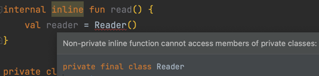

## 46. 함수 타입 파라미터를 갖는 함수에 inline 한정자를 붙여라

### [정의](https://sseung416-dev-note.vercel.app/kotlin-inline)
- `inline`: 함수의 본문을 함수 호출 부분으로 대체하는 것

### 장점
- reified 사용 가능: 제네릭은 컴파일 타임에 타입 소거되기 때문에 타입 정보를 얻을 수 없음, inline 타입 정보가 아규먼트 자체로 인라이닝되기 때문에 타입 정보를 얻을 수 있음
- 함수 타입 파라미터 사용 시 성능 개선: 무명 객체를 생성하지 않기 때문에 성능적 이점
- [비지역 반환(non-local return)](https://sseung416-dev-note.vercel.app/kotlin-inline#8cc65221b2624c3e927218c7c8d61b50)

### 단점
- 재귀적 동작이 불가능: 결국 다 대체되어 반복문과 같은 형태로 동작하기 때문
- 가시성 제한의 어려움: public 인라인 함수는 internal, private의 가시성을 가진 클래스나 함수를 호출할 수 없음, 모든 내용이 인라이닝되기 때문에 구현이 다 보이기 때문

- 너무 남발하면 코드가 매~우 길어질 수 있음

### 인라인 종류
- `noinline`: 인라이닝하지 않을 함수 타입 파라미터를 정의할 때 사용
- `crossinline`: 비지역 반환을 지원하지 않을 때 사용
- IDE에서 필요할 때 경고해주니 알기만하고 넘어가자

### 이럴 때 inline 함수를 사용하자
- reifed를 사용할 때
- reified 타입을 전달받는 경우
- 함수 타입 파라미터를 갖는 톱레벨 함수를 정의할 때