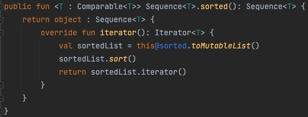

## 49. 하나 이상의 처리 단계를 가진 경우, 시퀀스를 사용하라

- `Iterable`: API가 호출될 때마다 즉시 연산
- `Sequence`: 최종 연산을 호출할 때까지 연산이 지연됨

### 시퀀스의 장점
#### 자연스러운 처리
- `Iterable`의 방식: `step-by-step order`, `eager order` (즉시 연산)
- `Sequence`의 방식: `element-by-element order`, `lazy order`
- 반복문과 조건문을 사용해서 처리한 방식 == `element-by-element order` -> 시퀀스가 훨씬 자연스러운 처리
```kotlin
// sequence: 하나씩 연산 후 결과가 5개가 되면 중지
val filtered = users.filter { it.age >= 20 }.take(5)

// for
val filtered = mutableListOf<User>()
var count = 0
for (user in users) {
    if (user.age >= 20) {
        filtered.add(user)
        count++
    }
    
    // 5개가 되면 중지
    if (count == 5) {
        break
    }
}
```

#### 최소 연산
- 중간 연산이 가능하기 때문에 원하는 곳까지만 연산이 가능


#### 무한 시퀀스
- 원하는 범위까지의 값만 가져올 수 있기 때문에 무한 시퀀스의 생성이 가능함
  - 피보나치, 원주율과 같이 무한한 수열을 계산할 수 있게 됨
  - 모든 연산을 처리하지 않기 떄문에 `Iterable`보다 훨씬 효율적
- 무한 시퀀스 생성법: `generateSequence`, `sequence`, `coroutine`
```kotlin
generateSequence(0) { it + 1 }

val fibonacci = sequence {
    yield(1)
    var current = 1
    var prev = 1
    while (true) {
    yield(current)
        val temp = prev
        prev = current
        current += temp
    }
}
```
- 수가 무한적이기 때문에 값을 제한하는 종결 연산(`take`, `first`)을 호출해야 함
```kotlin
fibonacci.take(4).toList()

fibonacci.toList() // 호출 시 종료되지 않음
```

> `yield`  
> 현재 시퀀스에 새로운 값을 추가하는 중단 함수, 호출하면 시퀀스는 잠깐 중단되고 전달된 값을 추가 후 다시 시퀀스를 시작함

#### 새로운 컬렉션 객체를 만들지 않음
- 표준 API는 연산 시 매번 새 컬렉션 객체를 만듦
  - 공간을 차지하는 비용이 듦
  - 컬렉션의 데이터가 크고 무거울수록 더 많은 메모리가 낭비
- [성능 테스트](https://sseung416-dev-note.vercel.app/kotlin-sequence#b7bff54d5597469d8b31d4fa13e62531)
  - 데이터가 많을 수록, 처리 과정이 많을수록, 시퀀스 사용을 추천

### 시퀀스가 빠르지 않은 경우
- 컬렉션 전체를 순회해야 하는 연산: `sorted` 등...
  - 시퀀스의 `sorted`는 시퀀스를 `List`로 변환한 후 자바의 sort를 사용하여 정렬하기 때문에 시퀀스를 사용하는 의미가 없음
  
  - 결국 `List`로 변환하기 때문에 시퀀스에 `sorted`를 사용하면 무한 반복에 빠질 수 있음

### 시퀀스 vs 스트림
#### 차이점
- 시퀀스가 스트림보다 더 많은 API를 제공함
- 스트림은 병렬 모드에서 실행이 가능함 ([성능 문제가 있지만...](https://m.blog.naver.com/tmondev/220945933678))
- 스트림은 JVM 8 이상, 코틀린/JVM 모듈에서만 사용 가능하지만 시퀀스는 코틀린/JVM, 코틀린/JS, 코틀린/네이티브 등 일반적인 모듈에서 모두 사용 가능 

#### 결론
- 병렬 모드를 지원하고자 한다면 스트림을, 그렇지 않은 경우에는 시퀀스를 사용하자

